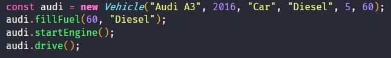
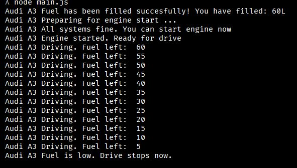
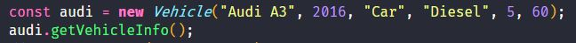
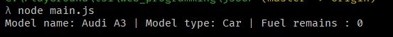
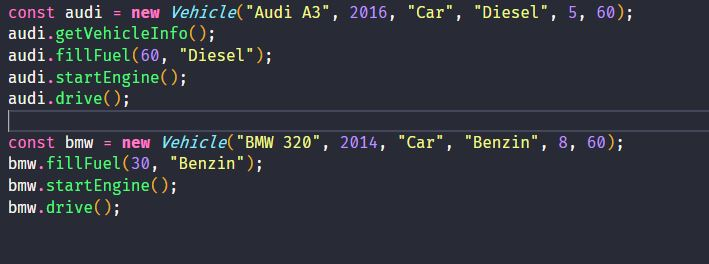
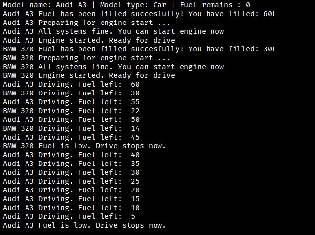

# WebCourse

[logo]: './img/oop_example2.JPG'

Simple OOP in JavaScript example

Creating new entity from class :

 
Console output:

 
Calling subclass method:

 
Console output:

 
Creating multiple subclasses:

 
Console output:

